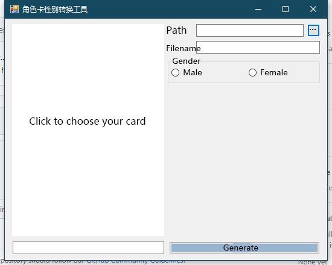

# Koikatu-Changing-Card-Gender
This is a simple tool used to change the gender of your character card of Koikatu. A new card with the gender that you ordered will be generated at the path that you allocated. Then you can move it to the corresponded folder.

1. Choose your card.
2. Choose the directory(path) where you want to save the card. And write a filename(suffix can be omitted). If you don't want to write a filename, a defaulte filename will be used. Just click "确认".
3. Choose the gender you want. Note that this step WILL NOT make any change to your original card.
4. Click "generate" and get your new card.

P.S.
A strict mode of detecting the card was used in past, but along with issues that were reported by users that it was failed on some cards, those rules are commented out now. A more "casual" rule is applyed, which means an increasing risk of destory your new card. If you want to re-on the strict mode, go to core.cs and find those comments.
